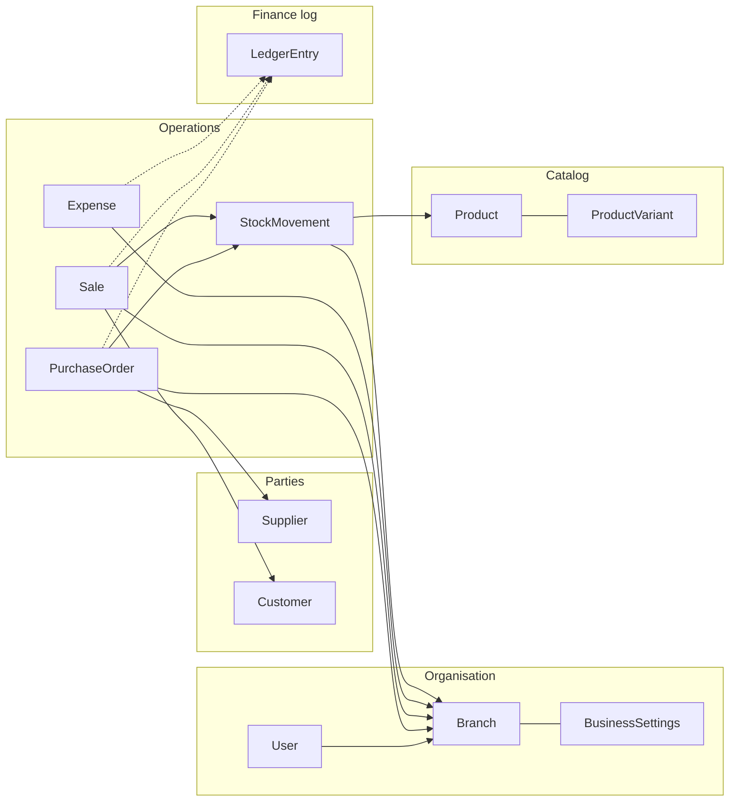

# Inventory Management System — Domain, schema, and flows

This document explains **how this project models the business** (database links, money flow, stock flow) in language you can reuse with **developers**, **sales**, or **operations**. It is grounded in the **current backend codebase** (`backend/apps/*`), not generic ERP theory.

---

## 1. Who should read what

| Audience | Focus on |
|----------|----------|
| **Developers** | Sections 3–6 (FK map, branch scope, when rows are created). |
| **Sales / pre-sales** | Sections 2, 7, 8 (story, hardware, integrations). |
| **Ops / finance** | Sections 4–5 (ledger meaning, what posts when). |

---

## 2. The story in one paragraph

A **branch** is a store or location. Staff log in as **users** and optionally pick a **working branch**. **Products** (catalog) are shared across the company; **stock** is adjusted when you **receive purchases**, **complete sales**, do **returns**, or record **movements**. **Customers** and **suppliers** hold balances that change when you sell on credit or buy on credit. **Expenses** are money out by category. The **ledger** is an append-only style log of accounting-style lines (sales, purchases, expenses) so finance can see what happened and tie it to branches. **POS** in this app is the **sales / billing** flow: create a sale, take payment, reduce stock.

---

## 3. Plain language: what is a “ledger”?

In accounting, a **ledger** is a record of **money movements** (who owes whom, cash in/out), often as **debits** and **credits**.

In **this** system, `LedgerEntry` is a simplified log:

- Each row has a **type** (e.g. sales, purchase, expense; and placeholders for customer, supplier, cash, bank).
- **Debit / credit / balance** store amounts for reporting.
- **`reference_id` + `ledger_type`** link the line back to the source document (e.g. sale id, purchase id, expense id) — not a SQL `ForeignKey`, by design, so one table can point at different document tables.
- **`branch`** ties the entry to a branch when the source document has a branch (sales, purchases, expenses).

So for **sales**: completing a sale can create stock movements **and** a `LedgerEntry` row with type `sales`. Same idea for **received purchases** (`purchase`) and **recorded expenses** (`expense`).

Trial balance / P&amp;L endpoints exist but some summary logic may still be **placeholder**; the **detailed list** of `LedgerEntry` rows is the reliable audit trail.

---

## 4. High-level entity map (how things link)

### 4.1 Organisation & access

| Entity | Role |
|--------|------|
| **Branch** | Physical/logical location; unique name in DB. |
| **User** | Login; optional `branch` = default working location; **shift** open/close uses this. |
| **BusinessSettings** | One-to-one with a **Branch**: tax, currency, templates, loyalty ratio. |
| **ShiftClosing** | Per **branch** + **cashier**: opening/closing cash, sales/expense totals for the shift. |

### 4.2 Catalog (mostly “global”)

| Entity | Role |
|--------|------|
| **Category**, **Brand** | Group products. |
| **Product** | SKU, **barcode**, prices, **`current_stock`** (global quantity on hand for non-variant stock). |
| **ProductVariant** | Optional SKU/stock per size/color/etc. |

**Important:** Product **master data** is **not** duplicated per branch. **Branch-specific quantity** is reflected mainly via **`StockMovement`** (and transfers) per **branch**, while `Product.current_stock` / `ProductVariant.stock` are updated by the same operational code paths — a design choice to be aware of when explaining “stock per branch” vs “one global bucket.”

### 4.3 Parties (who you trade with)

| Entity | Role |
|--------|------|
| **Supplier** | Vendor; **`current_balance`** updated when purchases increase what you owe. |
| **Customer** | Buyer; **`current_balance`** updated when sales increase what they owe (`due_amount`). |

### 4.4 Operations

| Entity | Role |
|--------|------|
| **PurchaseOrder** + **PurchaseItem** | Order from **supplier**, for a **branch**; when **received**, stock in + supplier balance + ledger. |
| **Sale** + **SaleItem** | Invoice to **customer** (optional), **cashier**, **branch**; when **completed**, stock out + customer balance (if credit) + ledger. |
| **StockMovement** | Every in/out: **product**, optional **variant**, **branch**, quantity, reason (`sale`, `purchase`, return, etc.). |
| **StockTransfer** | From **branch** A to **branch** B (pending/completed workflow in model). |
| **Expense** + **ExpenseCategory** | **Amount**, **date**, **branch**; creates a **ledger** line and is listed on the Expenses screen. |

### 4.5 Supporting

| Entity | Role |
|--------|------|
| **Coupon** | Discount codes linked to **sales** (optional). |
| **SalesReturn** / **PurchaseReturn** | Returns linked to original sale/purchase; stock and ledger behaviour implemented in services layer. |
| **Notification** | User alerts; can reference a **product** (e.g. low stock style messages). |
| **DocumentNumberSequence** | Per **branch**, year, doc type — sequential invoice numbers. |

---

## 5. What happens when — flows (for demos)

### 5.1 First-time setup (conceptual)

1. Create **branches**.
2. Configure **business settings** per branch (tax, currency, etc.).
3. Create **users**; assign **branch** on profile (header picker can set “working branch”).
4. Load **categories**, **products** (with **barcodes** if you scan at POS).
5. Add **suppliers** and **customers** as needed.

### 5.2 Purchase → inventory → supplier balance → ledger

1. User creates a **purchase order** (`PurchaseOrder`): **supplier**, **branch**, lines, amounts, status.
2. When status becomes **received** (and inventory not yet applied), service logic:
   - Increases **product** / **variant** stock.
   - Writes **`StockMovement`** (reason `purchase`, **branch** from PO).
   - Updates **supplier `current_balance`** by **due** portion.
   - Inserts **`LedgerEntry`** (`ledger_type=purchase`, `reference_id`=PO id, **`branch`** from PO).

### 5.3 Sale (POS / billing) → inventory → customer balance → ledger

1. User completes a **sale**: **branch**, **cashier**, lines, totals, paid vs due.
2. Service logic for a **completed** sale:
   - Decreases stock; **`StockMovement`** OUT with **branch** from sale.
   - If there is a **customer**, updates **`Customer.current_balance`** for **due** amount.
   - Inserts **`LedgerEntry`** (`ledger_type=sales`, `reference_id`=sale id, **`branch`** from sale).

### 5.4 Expense → ledger

1. User records **expense**: **category**, **amount**, **date**, **branch**.
2. Service creates **`LedgerEntry`** (`ledger_type=expense`, `reference_id`=expense id, **`branch`**).

### 5.5 Shift (cash drawer)

- **Open shift**: creates **`ShiftClosing`** with opening cash; requires user **branch**.
- **Close shift**: records cash count, optional declared sales/expenses, closes the row.

This is operational control, not full double-entry ledger by itself.

---

## 6. Diagram (mental model)

Solid arrows: foreign keys. Dotted: logical link via `ledger_type` + `reference_id` (not a single FK column to all document types).

---

## 7. Barcodes, QR codes, and hardware

### What the app does today

- Each **Product** has a **`barcode`** field (unique). The API can **look up** a product by barcode (`lookup_barcode`) and **suggest** a Code128 value from SKU (`generate_barcode`).
- The **frontend** can use a **camera-based scanner** (e.g. ZXing) to read **1D barcodes** that encode the same value stored on the product — that is the typical retail flow.

### QR codes

- **QR** is just another way to encode text (often a URL or an SKU/barcode string). If the QR encodes the **same string** as `Product.barcode`, the existing lookup API works.
- You do **not** need a separate “QR integration” unless you want **standards** like **GS1 Digital Link**, **EPCIS**, or supplier-specific labels — those would be **new** integration work.

### What you might still buy or integrate

| Need | Typical solution |
|------|------------------|
| Fast checkout | USB **barcode scanner** (keyboard wedge) or camera + web app |
| Label printing | External tool or integration with label printers; API only exposes values |
| Payments | **Card terminals** (Stripe, local bank POS): **not** in current models — would be new |
| Accounting export | CSV/API to **QuickBooks / Xero** — **not** built-in; ledger table is the internal source |

---

## 8. Talking to sales: “What can we claim?”

| Capability | Status in this codebase |
|------------|-------------------------|
| Multi-branch | Yes: branch on user, sales, purchases, expenses, movements, ledger, shifts. |
| Product catalog + variants | Yes. |
| Stock in/out with audit trail (`StockMovement`) | Yes. |
| Supplier / customer balances | Yes, updated from purchases/sales services. |
| Ledger-style journal lines for sales/purchases/expenses | Yes (`LedgerEntry`). |
| Full accounting (GL accounts, double-entry balance sheet) | **Not** fully modeled; ledger types are simplified. |
| Barcode lookup API | Yes. |
| Built-in payment gateway | **Not** in scope of models above. |
| Barcode/QR ** printing** | Generate value via API; physical printing is external. |

---

## 9. File reference (for developers)

When you need **truth**, read:

- `apps/settings_app/models.py` — Branch, BusinessSettings, ShiftClosing, sequences
- `apps/products/models.py` — Product, variant, barcode
- `apps/sales/models.py`, `apps/sales/services.py` — Sale completion, stock, ledger
- `apps/purchases/models.py`, `apps/purchases/services.py` — Receive, stock, ledger
- `apps/expenses/models.py`, `apps/expenses/services.py` — Expense → ledger
- `apps/inventory/models.py` — StockMovement, StockTransfer
- `apps/ledger/models.py` — LedgerEntry
- `apps/barcodes/views.py` — Lookup / generate (no DB table)

---

## 10. Glossary (quick)

| Term | Meaning here |
|------|----------------|
| **POS** | Point of sale: in this app, creating/completing **sales** (and related stock effects). |
| **SKU** | Stock keeping unit: unique product/variant identifier. |
| **Barcode** | Scannable value stored on **Product**; used to find the product at checkout or receiving. |
| **Ledger entry** | One row in **`LedgerEntry`** summarizing money effect of a sale, purchase, or expense (plus room for other types later). |
| **Branch** | Location dimension for sales, purchases, expenses, inventory movements, shifts, and many reports. |

---

*Generated to match the repository structure as of the project state when this file was added. If models change, update this doc or regenerate from migrations.*
